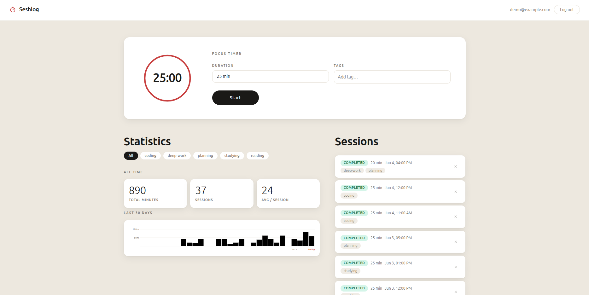

# Seshlog - Pomdoro Style Work Session Tracker

Deployed: [seshlog-production.up.railway.app](https://seshlog-production.up.railway.app/)

Pomodoro timer with a RESTful FastAPI and PostgreSQL backend. Sessions have a many-to-many relationship with tags, and the API tracks work sessions, statistics, and history per user with JWT authentication. You can start sessions, tag them by topic, pause and resume them, filter your history by tag, and view all-time totals alongside a 30-day activity chart. A TypeScript frontend ties it all together. The backend is covered by pytest integration tests that run against a real test database.
Containerrised with Docker and deployed via Railway with a basic CI/CD setup in Github Actions.



## Features

### Sessions

- Create, pause, resume, and complete work sessions
- Assign multiple tags to a session and filter history by tag
- All-time totals and a 30-day activity chart, both filterable by tag
- Expired sessions are auto-completed when the next request comes in

### Timer

- Countdown timer with an animated SVG progress ring
- Active session is restored when the page is reloaded
- Timer corrects itself when switching tabs and auto-completes if it ran out while the tab was hidden
- Browser notification when the timer finishes

### Backend

- Cookie-based JWT authentication; each user can only access their own data
- Rate limiting, input validation, and security headers on all endpoints
- Auto-generated interactive API docs at `/docs`
- Containerised with Docker Compose (backend + PostgreSQL)

### Deployment

- Deployed to Railway with a PostgreSQL service and environment variable management
- GitHub Actions pipeline runs the full pytest suite on every push and blocks merges if tests fail
- Passing builds on `main` trigger an automatic redeploy on Railway

## Tech stack

| Layer            | Technology                     |
| ---------------- | ------------------------------ |
| API              | FastAPI                        |
| ORM              | SQLModel (built on SQLAlchemy) |
| Database         | PostgreSQL                     |
| Validation       | Pydantic v2                    |
| Auth             | JWT (python-jose) + bcrypt     |
| Rate limiting    | slowapi                        |
| Frontend         | TypeScript                     |
| Testing          | pytest + FastAPI TestClient    |
| Containerisation | Docker                         |
| CI/CD            | GitHub Actions                 |
| Deployment       | Railway                        |

## API overview

### Auth

| Method | Endpoint         | Description                                         |
| ------ | ---------------- | --------------------------------------------------- |
| `POST` | `/auth/register` | Register a new user, sets an auth cookie            |
| `POST` | `/auth/login`    | Log in with email and password, sets an auth cookie |
| `POST` | `/auth/logout`   | Log out, clears the auth cookie                     |

Authentication is cookie-based. After login or register, the server sets an HttpOnly cookie (`access_token`) that is sent automatically with subsequent requests.

### Session endpoints

| Method   | Endpoint         | Description                                 |
| -------- | ---------------- | ------------------------------------------- |
| `POST`   | `/sessions`      | Create a new session                        |
| `GET`    | `/sessions`      | List all sessions (optional `?tag=` filter) |
| `GET`    | `/sessions/{id}` | Get a single session                        |
| `PATCH`  | `/sessions/{id}` | Update status or tags                       |
| `DELETE` | `/sessions/{id}` | Delete a session                            |

### Tags

| Method | Endpoint | Description                                  |
| ------ | -------- | -------------------------------------------- |
| `GET`  | `/tags`  | List all tags that have at least one session |

### Statistics

| Method | Endpoint      | Description                                               |
| ------ | ------------- | --------------------------------------------------------- |
| `GET`  | `/statistics` | All-time totals + 30-day daily breakdown (`?tag=` filter) |

## Data model

**UserTable**: `id`, `email`, `hashed_password`

**PomodoroSession**: `id`, `user_id` (FK to UserTable), `duration_minutes`, `started_at`, `status`, `paused_at`, `total_paused_seconds`

**Tag**: `id`, `name`

**SessionTagLink** (join table): `session_id` (FK), `tag_id` (FK)

A user has many sessions. A session has many tags and a tag can belong to many sessions, linked through SessionTagLink. Tags are stored once and reused. Deleting a session automatically cleans up orphaned tag links.

## Project structure

```text
pomodoro-app/
├── app/
│   ├── api/
│   │   ├── auth.py             # register, login, and logout endpoints
│   │   ├── frontend.py         # serves the frontend pages (/, /imprint, /privacy)
│   │   ├── health.py           # health check endpoint
│   │   ├── sessions.py         # session CRUD endpoints
│   │   ├── statistics.py       # statistics endpoint
│   │   └── tags.py             # tags endpoint
│   ├── core/
│   │   ├── config.py           # environment/settings
│   │   ├── limiter.py          # rate limiter setup
│   │   ├── logging.py          # logging setup
│   │   └── security.py         # JWT creation, decoding, and auth dependency
│   ├── db/
│   │   └── schema.py           # database table definitions
│   ├── models/
│   │   ├── session.py          # session request/response models
│   │   ├── statistics.py       # statistics response models
│   │   ├── tag.py              # tag request/response models
│   │   ├── token.py            # TokenResponse model
│   │   └── user.py             # UserCreate and User models
│   ├── services/
│   │   ├── auth_service.py     # registration and login logic
│   │   ├── session_service.py  # session business logic
│   │   ├── statistics_service.py # statistics queries and aggregation
│   │   └── tag_service.py      # tag business logic
│   └── main.py                 # app entry point, middleware setup
├── frontend/
│   ├── src/
│   │   ├── app.ts              # TypeScript source for the demo UI
│   │   └── types.ts            # shared TypeScript interfaces
│   ├── static/
│   │   ├── index.html          # main app page
│   │   ├── imprint.html        # legal notice page
│   │   ├── privacy.html        # privacy policy page
│   │   ├── app.js              # compiled frontend JS
│   │   ├── types.js            # compiled types
│   │   └── styles.css          # styles
│   ├── package.json
│   └── tsconfig.json
├── tests/
│   ├── conftest.py             # fixtures and test database setup
│   ├── test_auth.py            # auth endpoint tests
│   ├── test_frontend.py        # frontend route tests
│   ├── test_sessions.py        # session endpoint tests
│   ├── test_statistics.py      # statistics endpoint tests
│   └── test_tags.py            # tags endpoint tests
├── scripts/
│   └── seed_demo.py            # creates the demo account and populates it with sample sessions
├── .env                        # local environment variables (not committed)
├── .env.test                   # test database config (not committed)
├── pytest.ini                  # pytest configuration
├── requirements.txt
├── Dockerfile                  # builds the backend image
├── docker-compose.yml          # defines the backend and database services
├── .dockerignore
└── README.md
```

## Running locally

### With Docker (recommended)

Requires [Docker](https://docs.docker.com/get-docker/) with the Compose plugin.

#### 1. Clone the repo

```bash
git clone https://github.com/Latfoo/pomodoro-app
cd pomodoro-app
```

#### 2. Configure the environment

Create a `.env` file in the project root:

```env
DB_USER=your_user
DB_PASSWORD=your_password
DB_NAME=pomodoro
SECRET_KEY=your-secret-key
APP_ENV=development
```

`APP_ENV=development` disables the `Secure` flag on the auth cookie so it works over plain HTTP on localhost. Set it to `production` when deploying over HTTPS.

#### 3. Start the app

```bash
docker compose up --build
```

This starts two containers: the FastAPI backend and a PostgreSQL database. The API runs at `http://localhost:8000` and the interactive docs are at `http://localhost:8000/docs`.

To seed the demo account, run once after the containers are up:

```bash
docker compose exec backend python3 scripts/seed_demo.py
```

### Without Docker

Requires Python 3.12+ and PostgreSQL installed locally.

#### 1. Clone and set up the environment

```bash
git clone https://github.com/Latfoo/pomodoro-app
cd pomodoro-app
python -m venv venv
source venv/bin/activate
pip install -r requirements.txt
```

#### 2. Set up PostgreSQL

```bash
sudo -u postgres psql
```

```sql
CREATE USER your_user WITH PASSWORD 'your_password';
CREATE DATABASE pomodoro OWNER your_user;
\q
```

#### 3. Configure the environment

Create a `.env` file in the project root:

```env
DB_USER=your_user
DB_PASSWORD=your_password
DB_NAME=pomodoro
SECRET_KEY=your-secret-key
APP_ENV=development
```

`APP_ENV=development` disables the `Secure` flag on the auth cookie so it works over plain HTTP on localhost. Set it to `production` when deploying over HTTPS.

#### 4. Start the server

```bash
uvicorn app.main:app --reload
```

The API runs at `http://localhost:8000` and the interactive docs are at `http://localhost:8000/docs`.

To seed the demo account, run:

```bash
python3 scripts/seed_demo.py
```

## Testing

The test suite uses pytest and FastAPI's `TestClient`. Tests run against a real PostgreSQL database that gets wiped and recreated before each test, so they never touch your development data.

### Set up a test database

```bash
sudo -u postgres psql
```

```sql
CREATE DATABASE pomodoro_test OWNER your_user;
\q
```

### Configure the test environment

Create a `.env.test` file in the project root pointing at the test database:

```env
DB_USER=your_user
DB_PASSWORD=your_password
DB_NAME=pomodoro_test
SECRET_KEY=any-secret-key
APP_ENV=development
RATELIMIT_ENABLED=false
```

### Run the tests

```bash
pytest
```

### What's covered

| File                 | What it tests                                                                                                     |
| -------------------- | ----------------------------------------------------------------------------------------------------------------- |
| `test_auth.py`       | Registering, logging in, logging out, tokens                                                                      |
| `test_sessions.py`   | Creating, editing, and deleting sessions; pausing and resuming; users can't see each other's data (authorization) |
| `test_statistics.py` | Totals and tag filtering; users only see their own stats                                                          |
| `test_tags.py`       | Tag listing and cleanup when a session is deleted                                                                 |

## Demo account

A "Try Demo" button in the header logs straight into a pre-populated demo account so anyone visiting the deployed app can explore it without registering.

To set up the demo account, run the seed script once after the containers are up:

```bash
docker compose exec backend python3 scripts/seed_demo.py
```

This creates the user `demo@example.com` with password `demo1234` and inserts 37 completed sessions spread across the last four weeks, tagged with `coding`, `deep-work`, `studying`, `reading`, and `planning`. The script is idempotent and will skip creation if the account already exists.

## Example requests

### Register

```bash
curl -c cookies.txt -X POST http://localhost:8000/auth/register \
  -H "Content-Type: application/json" \
  -d '{"email": "you@example.com", "password": "yourpassword"}'
```

### Create a session

```bash
curl -b cookies.txt -X POST http://localhost:8000/sessions \
  -H "Content-Type: application/json" \
  -d '{"duration_minutes": 25, "tags": ["work", "backend"]}'
```

### List sessions filtered by tag

```bash
curl -b cookies.txt http://localhost:8000/sessions?tag=backend
```

### Mark a session as completed

```bash
curl -b cookies.txt -X PATCH http://localhost:8000/sessions/1 \
  -H "Content-Type: application/json" \
  -d '{"status": "completed"}'
```
